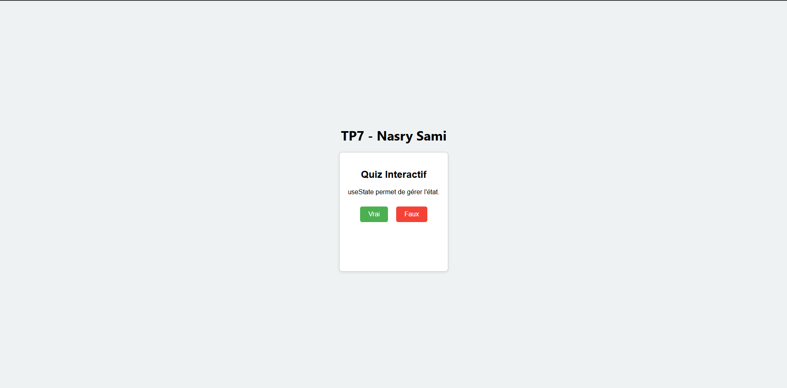

# TP7 - Quiz Interactif (React)

> Auteur : **Nasry Sami**  
> TP7 du module React  
> Objectif : Créer une application de quiz interactif avec des transitions animées.

## 🎯 Objectif du TP

Créer une application en React permettant à l'utilisateur de répondre à une série de questions **vrai ou faux**, avec les fonctionnalités suivantes :

- Affichage dynamique des questions.
- Gestion des réponses utilisateur.
- Calcul du score.
- Possibilité de recommencer le quiz.
- **Animation fluide entre les questions** (fade / slide).

---

## 🧠 Fonctionnement

- Les questions sont définies dans un tableau en haut du composant React.
- L'utilisateur choisit **Vrai** ou **Faux**.
- Le composant indique si la réponse est correcte ou non.
- Ensuite, il peut passer à la question suivante.
- À la fin, le score total est affiché avec une option pour recommencer.

---

## ✨ Animation ajoutée

L'application utilise une **transition douce (fade et slide)** entre les questions :

- Lors du changement de question, le texte **disparaît en fondu et glisse légèrement vers le bas**, puis réapparaît.
- Cela rend l'expérience utilisateur plus agréable et fluide.

> 🎨 L'animation est réalisée uniquement avec des **styles CSS**, sans librairie externe.

---

## 🛠️ Technologies utilisées

- **React (useState, useEffect)**
- CSS inline (avec des transitions)
- Aucun package externe (juste du React pur)

---

## 🖥️ Aperçu

 

---

Merci de votre attention !

> *Projet réalisé dans le cadre du TP7 React – Nasry Sami*
